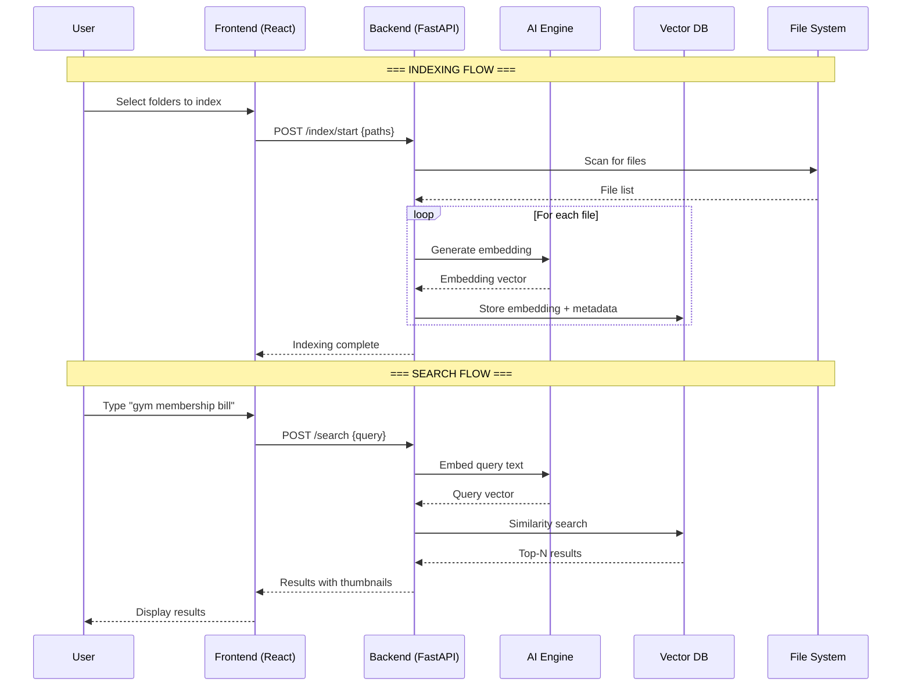

# FindMyPic — Product Requirements Document (PRD)

> **Version:** 1.0  
> **Date:** 2026-02-25  
> **Author:** AI-Assisted  
> **Status:** Draft — Awaiting Approval  

---

## 1. Project Overview

### 1.1 What Is FindMyPic?

FindMyPic is a **fully local, privacy-first** desktop application that lets you search your files (photos, documents, bills, receipts, screenshots, etc.) using natural language. Instead of manually browsing through thousands of files, you type what you're looking for — like *"gym membership bill"* or *"sunset photo from the beach"* — and the AI finds matching files on your hard drive.

### 1.2 The Problem

- Users accumulate thousands of photos and documents across drives over the years.
- File names are often generic (`IMG_20231015.jpg`, `scan001.pdf`) and useless for searching.
- Windows/Mac built-in search only matches **file names**, not **file contents or visual content**.
- Cloud solutions (Google Photos, iCloud) require uploading private data to third-party servers.
- Finding a specific bill, receipt, or photo from years ago is a frustrating, manual needle-in-a-haystack task.

### 1.3 The Solution

FindMyPic **runs AI entirely on the user's machine** to:

1. **Index** all images and documents in a selected drive/folder.
2. **Generate AI embeddings** (vector representations) for every file — capturing what's *in* the image or document, not just its file name.
3. **Search** those embeddings instantly using natural language queries.
4. **Zero cloud uploads** — everything stays local.

### 1.4 One-Line Summary

> A local-first AI desktop app that lets you search your photos and documents by describing what's in them, without ever uploading anything to the cloud.

---

## 2. Goals & Success Metrics

| Goal | Metric | Target |
|---|---|---|
| Fast natural-language file search | Query-to-results latency | < 3 seconds for 50K indexed files |
| Privacy-first | Data uploaded to external servers | **0 bytes** — always |
| Easy setup | Time from install to first search | < 10 minutes |
| Accurate results | User satisfaction with top-5 results | > 80% relevance |
| Cross-format support | File types supported | JPG, PNG, WEBP, BMP, TIFF, PDF, DOCX, XLSX |

---

## 3. Target Users

| Persona | Description |
|---|---|
| **Digital Hoarder** | Has 50K+ photos/scans/docs across multiple drives with no consistent naming. Wants to find things fast. |
| **Privacy-Conscious User** | Refuses to upload personal files to Google/Apple/cloud services. Wants an offline-first solution. |
| **Freelancer / Small Business** | Needs to quickly locate invoices, contracts, receipts from past years. |
| **Student / Researcher** | Wants to search across scanned notes, diagrams, lecture slides. |

---

## 4. Core Features

### 4.1 100% Local AI Engine

FindMyPic runs **entirely on your machine**. No cloud. No API keys. No internet required. Zero data ever leaves your PC.

| Aspect | Detail |
|---|---|
| **How it works** | Runs AI models locally via [Ollama](https://ollama.com) and/or a bundled ONNX runtime. |
| **Models used** | **CLIP** for image embeddings. **LLaVA / Moondream** for optional image captioning. **Tesseract OCR** for text extraction from scanned docs. |
| **Hardware required** | 8 GB RAM minimum. GPU recommended but not required (CPU fallback). |
| **Privacy** | ✅ 100% local. Nothing leaves the machine. Ever. |
| **Cost** | Free. Models are open-source. |

> [!IMPORTANT]
> On first launch, the app **auto-detects** the user's GPU and recommends the best model tier (see Section 8).

### 4.1.1 GPU Auto-Detection & Model Recommendation

At first launch (and in Settings), the app detects the user's hardware and recommends the optimal model configuration:

#### Tier 1 — No GPU / Integrated Graphics (Intel UHD, AMD Vega)
> *Laptops, older desktops, office PCs*

| Component | Recommended Model | Size | Speed | Notes |
|---|---|---|---|---|
| **Image Embedding** | CLIP ViT-B/32 (ONNX, INT8 quantized) | ~90 MB | ~3-5 files/sec | Runs on CPU. Smallest, fastest. Good enough accuracy. |
| **Image Captioning** | Moondream 2 (1.8B, Q4) | ~1.1 GB | ~5-8 sec/image | Optional. Small VLM, runs acceptably on CPU. |
| **Text Embedding** | all-MiniLM-L6-v2 (ONNX) | ~90 MB | ~50 files/sec | For document/OCR text. Very fast on CPU. |
| **OCR** | Tesseract | ~30 MB | ~2 sec/page | CPU-only by design. |
| **Total disk** | | ~1.3 GB | | |
| **RAM usage** | | ~800 MB - 1.5 GB during indexing | | |

#### Tier 2 — Entry-Level GPU (GTX 1650, RTX 2060, RTX 3050, RX 6600 — 4-6 GB VRAM)
> *Budget gaming PCs, mid-range laptops with dedicated GPU*

| Component | Recommended Model | Size | Speed | Notes |
|---|---|---|---|---|
| **Image Embedding** | CLIP ViT-B/16 (ONNX, FP16) | ~350 MB | ~20-40 files/sec | GPU-accelerated. Better accuracy than ViT-B/32. |
| **Image Captioning** | Moondream 2 (1.8B, Q4) via Ollama | ~1.1 GB | ~1-2 sec/image | Fits in 4 GB VRAM easily. |
| **Text Embedding** | all-MiniLM-L6-v2 (ONNX) | ~90 MB | ~100+ files/sec | GPU gives massive speedup for batch embedding. |
| **OCR** | Tesseract | ~30 MB | ~2 sec/page | Still CPU. Not GPU-accelerated. |
| **Total disk** | | ~1.6 GB | | |
| **VRAM usage** | | ~2-3 GB during indexing | | |

#### Tier 3 — Mid-Range GPU (RTX 3060/3070, RTX 4060/4070, RX 6700/6800 — 8-12 GB VRAM)
> *Gaming desktops, content creator machines*

| Component | Recommended Model | Size | Speed | Notes |
|---|---|---|---|---|
| **Image Embedding** | CLIP ViT-L/14 (ONNX, FP16) | ~1.7 GB | ~50-80 files/sec | Best CLIP model. Significantly more accurate. |
| **Image Captioning** | LLaVA 1.6 (7B, Q4) via Ollama | ~4.1 GB | ~0.5-1 sec/image | Rich, detailed captions. Fits in 8 GB VRAM. |
| **Text Embedding** | nomic-embed-text (ONNX) | ~270 MB | ~150+ files/sec | Better quality than MiniLM for documents. |
| **OCR** | Tesseract | ~30 MB | ~2 sec/page | CPU. |
| **Total disk** | | ~6.1 GB | | |
| **VRAM usage** | | ~5-7 GB during indexing | | |

#### Tier 4 — High-End GPU (RTX 3090, RTX 4080/4090, RX 7900 XTX — 16-24 GB VRAM)
> *Enthusiast / workstation builds*

| Component | Recommended Model | Size | Speed | Notes |
|---|---|---|---|---|
| **Image Embedding** | CLIP ViT-L/14 (ONNX, FP16) | ~1.7 GB | ~100+ files/sec | Runs at full speed. |
| **Image Captioning** | LLaVA 1.6 (13B, Q4) via Ollama | ~7.4 GB | ~0.3-0.5 sec/image | Most accurate captions. Runs comfortably. |
| **Text Embedding** | nomic-embed-text (ONNX) | ~270 MB | ~200+ files/sec | |
| **OCR** | Tesseract + EasyOCR (GPU) | ~600 MB | ~0.5 sec/page | EasyOCR leverages GPU for faster, better OCR. |
| **Total disk** | | ~10 GB | | |
| **VRAM usage** | | ~10-14 GB during indexing | | |

#### How Auto-Detection Works

```python
# Pseudocode for GPU detection at startup
1. Detect GPU via `torch.cuda.is_available()` / `onnxruntime.get_device()`
2. Read GPU name + VRAM via `torch.cuda.get_device_properties()`
3. Classify into Tier 1-4 based on VRAM:
     - No GPU / < 4 GB VRAM  → Tier 1 (CPU mode)
     - 4-6 GB VRAM           → Tier 2
     - 8-12 GB VRAM          → Tier 3
     - 16+ GB VRAM           → Tier 4
4. Present recommendation to user with [Accept] or [Customize] options
5. User can always override in Settings → AI Models
```

> [!NOTE]
> The app downloads only the models for the selected tier. Users can upgrade/downgrade tiers anytime from Settings.

### 4.2 Smart Indexing Engine

| Feature | Description |
|---|---|
| **Folder / Drive Selection** | User picks specific folders, entire drives, or "whole PC" to index. |
| **Incremental Indexing** | After the first full scan, only new/modified files are re-indexed. Uses file modification timestamps + hash-based change detection. |
| **Background Indexing** | Indexing runs as a background process and doesn't block the UI. Progress bar + ETA shown. |
| **File Type Support** | Images: JPG, PNG, WEBP, BMP, TIFF, GIF, HEIC. Documents: PDF, DOCX, XLSX, TXT, CSV. Screenshots. |
| **Exclusion Rules** | User can exclude specific folders (e.g., `node_modules`, `.git`, system dirs). Default exclusions for OS system folders. |
| **Index Storage** | All embeddings stored in a local vector database (ChromaDB or LanceDB) on disk. |
| **Metadata Extraction** | EXIF data (date, location, camera), file size, creation/mod dates stored alongside embeddings. |

### 4.3 Natural Language Search

| Feature | Description |
|---|---|
| **Semantic Search** | Query is converted to an embedding and matched against indexed file embeddings via cosine similarity. |
| **Hybrid Search** | Combines semantic vector search with keyword/metadata search for better results. E.g., *"gym bill from 2023"* uses semantic for "gym bill" + date filter for "2023". |
| **Search Filters** | Filter by: file type, date range, folder/drive, file size. |
| **Result Ranking** | Results sorted by relevance score. Top-N results shown (default: 20). |
| **Result Preview** | Thumbnail preview for images. Text snippet preview for documents. Full-size view on click. |
| **Quick Actions** | From results: Open file, Open containing folder, Copy path, Delete, Add to favorites. |

### 4.4 User Interface

The application will be a **desktop app** built with **Electron + React** (or Tauri + React for a lighter alternative).

#### Key Screens

| Screen | Description |
|---|---|
| **Onboarding / Setup** | GPU detection, model recommendation, folder selection, first index trigger. |
| **Home / Search** | Large search bar (center stage). Recent searches. Quick stats (files indexed, last index time). |
| **Results View** | Grid/List toggle for results. Thumbnails, relevance scores, file paths. Filters sidebar. |
| **File Detail** | Full preview. AI-generated caption/description. File metadata. Actions (open, copy path, etc.). |
| **Indexing Dashboard** | Progress of current/past indexing jobs. Stats: files indexed per type, total size, errors. |
| **Settings** | Model tier switch. Manage indexed folders. Exclusion rules. Appearance (dark/light mode). Clear index. |

### 4.5 System Tray / Background Service

| Feature | Description |
|---|---|
| **Tray Icon** | App minimizes to system tray. Shows indexing status. |
| **File Watcher** | Optionally watches indexed folders for new/changed files and auto-indexes them in the background. |
| **Global Hotkey** | Configurable keyboard shortcut (e.g., `Ctrl+Shift+F`) to instantly open the search bar from anywhere. |

---

## 5. Technical Architecture

### 5.1 High-Level Architecture

```
┌───────────────────────────────────────────────────────────────┐
│                     FINDMYPIC DESKTOP APP                     │
├────────────────────────┬──────────────────────────────────────┤
│                        │                                      │
│   Frontend (React)     │   Backend (Python FastAPI)            │
│                        │                                      │
│  ┌──────────────────┐  │  ┌──────────────────────────────┐   │
│  │  Search Bar UI   │──│──│  Search Engine                │   │
│  │  Results Grid    │  │  │  ├─ Query Embedding           │   │
│  │  File Preview    │  │  │  ├─ Vector Similarity Search  │   │
│  │  Settings Panel  │  │  │  └─ Result Ranking            │   │
│  └──────────────────┘  │  └──────────┬───────────────────┘   │
│                        │             │                        │
│                        │  ┌──────────▼───────────────────┐   │
│                        │  │  Indexing Engine              │   │
│                        │  │  ├─ File Scanner              │   │
│                        │  │  ├─ AI Embedding Generator    │   │
│                        │  │  ├─ OCR Text Extractor        │   │
│                        │  │  ├─ Metadata Extractor        │   │
│                        │  │  └─ Change Detector           │   │
│                        │  └──────────┬───────────────────┘   │
│                        │             │                        │
│                        │  ┌──────────▼───────────────────┐   │
│                        │  │  Local AI Engine              │   │
│                        │  │  ├─ CLIP (ONNX Runtime)       │   │
│                        │  │  ├─ LLaVA/Moondream (Ollama)  │   │
│                        │  │  └─ GPU Auto-Detect + Tiering │   │
│                        │  └──────────────────────────────┘   │
│                        │                                      │
│                        │  ┌──────────────────────────────┐   │
│                        │  │  Vector Database              │   │
│                        │  │  (ChromaDB / LanceDB)         │   │
│                        │  │  Stored locally on disk       │   │
│                        │  └──────────────────────────────┘   │
│                        │                                      │
├────────────────────────┴──────────────────────────────────────┤
│                    Local File System                           │
│            Drives / Folders / Files (never uploaded)           │
└───────────────────────────────────────────────────────────────┘
```

### 5.2 Tech Stack (Recommended)

| Layer | Technology | Rationale |
|---|---|---|
| **Desktop Shell** | **Electron** (or Tauri for lighter builds) | Cross-platform, mature ecosystem. |
| **Frontend** | **React + TypeScript** | Component-based, large ecosystem, familiar to most devs. |
| **Backend** | **Python (FastAPI)** | Best AI/ML library support (CLIP, Tesseract, ChromaDB all have Python SDKs). |
| **Vector DB** | **ChromaDB** (embedded mode) | Lightweight, embeddable, no separate server needed. Stores on disk. |
| **Local AI Runtime** | **Ollama** (for LLaVA/Moondream) + **ONNX Runtime** (for CLIP/embeddings) | Ollama simplifies model management. ONNX gives fast CPU/GPU inference. |
| **GPU Detection** | **PyTorch** (CUDA check) or **GPUtil** | Detects GPU model, VRAM, and recommends model tier. |
| **OCR** | **Tesseract OCR** (via `pytesseract`) | Open-source, well-supported, runs locally. |
| **File Watching** | **Watchdog** (Python) | Efficient cross-platform file system event monitoring. |
| **IPC** | **HTTP (localhost)** or **WebSocket** | Frontend ↔ Backend communication. |

### 5.3 Data Flow



### 5.4 Directory / Project Structure

```
FindMyPic/
├── frontend/                   # React app (Electron renderer)
│   ├── src/
│   │   ├── components/         # UI components
│   │   │   ├── SearchBar.tsx
│   │   │   ├── ResultsGrid.tsx
│   │   │   ├── FilePreview.tsx
│   │   │   ├── SettingsPanel.tsx
│   │   │   ├── IndexingDashboard.tsx
│   │   │   └── Onboarding.tsx
│   │   ├── hooks/              # Custom React hooks
│   │   ├── services/           # API client calls
│   │   ├── store/              # State management
│   │   ├── styles/             # CSS / theme
│   │   ├── App.tsx
│   │   └── main.tsx
│   ├── public/
│   ├── package.json
│   └── electron/               # Electron main process
│       ├── main.ts
│       ├── preload.ts
│       └── tray.ts
│
├── backend/                    # Python backend
│   ├── app/
│   │   ├── main.py             # FastAPI app entry point
│   │   ├── api/
│   │   │   ├── search.py       # Search endpoints
│   │   │   ├── index.py        # Indexing endpoints
│   │   │   └── settings.py     # Settings endpoints
│   │   ├── core/
│   │   │   ├── config.py       # App configuration
│   │   │   ├── indexer.py      # File scanning & indexing logic
│   │   │   ├── embedder.py     # AI embedding generation (local only)
│   │   │   ├── searcher.py     # Vector search logic
│   │   │   ├── ocr.py          # OCR text extraction
│   │   │   ├── metadata.py     # EXIF / file metadata extraction
│   │   │   └── watcher.py      # File system watcher
│   │   ├── models/
│   │   │   ├── file_record.py  # File data models
│   │   │   └── search.py       # Search request/response models
│   │   ├── db/
│   │   │   └── vector_store.py # ChromaDB wrapper
│   │   └── ai/
│   │       ├── base.py         # Abstract AI backend interface
│   │       ├── clip_embed.py   # CLIP image embedding (ONNX)
│   │       ├── text_embed.py   # Text embedding (MiniLM / Nomic)
│   │       ├── captioner.py    # LLaVA / Moondream captioning (Ollama)
│   │       └── gpu_detect.py   # GPU detection + tier recommendation
│   ├── requirements.txt
│   ├── pyproject.toml
│   └── tests/
│
├── data/                       # Local data (gitignored)
│   ├── chroma_db/              # Vector database files
│   ├── thumbnails/             # Cached thumbnails
│   └── config.json             # User settings
│
├── PRD.md                      # This document
├── README.md
├── .gitignore
└── package.json                # Root scripts
```

---

## 6. Detailed Feature Specs

### 6.1 Onboarding Flow

```
Step 1: Welcome Screen
  → "FindMyPic — Find any file by describing it."
  → "100% local. 100% private. Nothing ever leaves your PC."
  → [Get Started] button

Step 2: Hardware Detection
  → App auto-detects GPU and RAM
  → Shows detected hardware:
     "Detected: NVIDIA RTX 3060 (12 GB VRAM), 16 GB RAM"
  → Recommends model tier:
     "Recommended: Tier 3 — High accuracy, fast indexing"
     "Models to download: ~6.1 GB"
  → [Accept Recommendation] or [Customize Models]
  → Customize lets user pick individual models per component

Step 3: Model Download
  → Downloads selected models (CLIP, captioner, text embedder)
  → Progress bar per model + total progress
  → "This is a one-time download."

Step 4: Folder Selection
  → "Choose what to index:"
  → [Add Folder] [Add Entire Drive] [Index Whole PC]
  → Show selected paths with estimated file count
  → Exclusion rules (auto-exclude system folders)

Step 5: Start Indexing
  → "Ready! Indexing X files. This may take a while."
  → Progress bar with ETA (adjusted to detected hardware speed)
  → "You can start searching while indexing is in progress."
```

### 6.2 Search UX Details

- **Instant search**: Results update as you type (debounced 300ms).
- **Search history**: Last 50 searches stored locally, shown as suggestions.
- **Empty state**: Show tips like *"Try: 'passport photo', 'utility bill 2024', 'family dinner'"*.
- **No results state**: Suggest broadening the query or checking if the folder is indexed.
- **Keyboard-first**: `Enter` to search, `↑↓` to navigate results, `Enter` to open, `Ctrl+Enter` to open folder.

### 6.3 Indexing Details

| Parameter | Default | Configurable |
|---|---|---|
| Batch size (files per batch) | 32 | Yes |
| Max concurrent threads | 4 | Yes |
| Thumbnail generation | Enabled | Yes |
| Thumbnail max dimension | 256px | Yes |
| OCR for scanned PDFs | Enabled | Yes |
| File size limit for indexing | 100MB | Yes |
| Re-index interval (watcher) | Realtime (filesystem events) | Yes |

### 6.4 Supported File Types

| Category | Extensions | Processing |
|---|---|---|
| **Photos** | .jpg, .jpeg, .png, .webp, .bmp, .tiff, .gif, .heic | CLIP visual embedding + EXIF metadata |
| **Screenshots** | .jpg, .png | CLIP visual embedding + OCR text extraction |
| **Documents** | .pdf | OCR text extraction + text embedding |
| **Office Docs** | .docx, .xlsx, .pptx | Text extraction + text embedding |
| **Plain Text** | .txt, .csv, .md | Direct text embedding |

---

## 7. Non-Functional Requirements

| Requirement | Specification |
|---|---|
| **Performance** | Search latency < 3s for 50K files. Indexing throughput: ~3-5 files/sec (CPU, Tier 1) to ~100+ files/sec (GPU, Tier 4). |
| **Storage** | Vector DB: ~1KB per file indexed. Thumbnails: ~20KB each. Models: 1.3–10 GB depending on tier. 50K files ≈ ~1.1 GB index data. |
| **Memory** | App idle: < 200MB RAM. During indexing: 800 MB (Tier 1) to 2 GB (Tier 4). |
| **Startup** | App launch to search-ready: < 5 seconds. |
| **Platform** | Windows 10/11 (primary). macOS and Linux (future). |
| **Offline** | ✅ Fully functional offline. Always. No internet required after initial model download. |
| **Security** | No telemetry. No data collection. **Zero network calls** after model download. No API keys. No accounts. |

---

## 8. AI Model Tier — Performance Benchmarks (Expected)

| Metric | Tier 1 (CPU) | Tier 2 (4-6 GB GPU) | Tier 3 (8-12 GB GPU) | Tier 4 (16+ GB GPU) |
|---|---|---|---|---|
| **Image embedding speed** | ~3-5 files/sec | ~20-40 files/sec | ~50-80 files/sec | ~100+ files/sec |
| **Captioning speed** | ~5-8 sec/image | ~1-2 sec/image | ~0.5-1 sec/image | ~0.3-0.5 sec/image |
| **Text embedding speed** | ~50 files/sec | ~100+ files/sec | ~150+ files/sec | ~200+ files/sec |
| **Search latency** | < 2s | < 1s | < 0.5s | < 0.3s |
| **Index 10K images** | ~45 min | ~8 min | ~3 min | ~1.5 min |
| **Index 50K images** | ~3.5 hours | ~35 min | ~15 min | ~8 min |
| **Accuracy (subjective)** | Good | Good+ | Very Good | Very Good |
| **Model disk space** | ~1.3 GB | ~1.6 GB | ~6.1 GB | ~10 GB |
| **VRAM usage** | 0 (CPU) | ~2-3 GB | ~5-7 GB | ~10-14 GB |
| **RAM usage** | ~800 MB-1.5 GB | ~1 GB | ~1.5 GB | ~2 GB |

---

## 9. Milestones & Phased Delivery

### Phase 1 — MVP (Core Search)
> **Goal:** User can index a folder and search for images by description.

- [ ] Python backend with FastAPI
- [ ] CLIP-based image embedding (local via ONNX)
- [ ] ChromaDB vector storage
- [ ] Basic React UI: search bar + results grid
- [ ] Electron wrapper
- [ ] Onboarding: folder selection + indexing

### Phase 2 — Document Support + Captioning
> **Goal:** Add document search and AI image captioning.

- [ ] OCR integration (Tesseract) for PDFs / scanned docs
- [ ] Text extraction for DOCX, XLSX, TXT
- [ ] LLaVA / Moondream captioning integration (via Ollama)
- [ ] GPU auto-detection and model tier recommendation
- [ ] Settings page with model tier management
- [ ] Search filters (date, type, folder)

### Phase 3 — Polish & Power Features
> **Goal:** Production-quality UX and advanced capabilities.

- [ ] Incremental indexing (only new/changed files)
- [ ] File system watcher for auto-indexing
- [ ] System tray integration + global hotkey
- [ ] Dark/Light theme
- [ ] Search history + favorites
- [ ] Thumbnail caching
- [ ] Performance optimization for 100K+ files

### Phase 4 — Advanced (Future)
> **Goal:** Power-user and expansion features.

- [ ] Duplicate file detection (by visual similarity)
- [ ] Face recognition + people search ("photos of John")
- [ ] Multi-language OCR
- [ ] Network drive support
- [ ] Plugin system for custom file type processors
- [ ] macOS + Linux support

---

## 10. Risks & Mitigations

| Risk | Impact | Mitigation |
|---|---|---|
| Local AI too slow on weak hardware | Users abandon the app | Tier 1 uses smallest quantized models. Show realistic time estimates. Allow background indexing. |
| Large drives take hours to index | Frustration | Incremental indexing. Allow searching during indexing. Show progress + ETA. Let user prioritize specific folders. |
| CLIP accuracy insufficient for documents | Bad search results for text-heavy files | Combine CLIP with OCR + text embeddings for hybrid search. |
| Electron app too heavy | Slow startup, high memory | Consider Tauri as lighter alternative. Lazy-load components. |
| Model download too large | Users on slow internet give up | Show per-model sizes. Allow selective download (e.g., skip captioning model). Tier 1 is only ~1.3 GB. |
| GPU not detected correctly | Wrong tier recommended | Allow manual override. Provide test/benchmark button. Support NVIDIA + AMD GPUs. |

---

## 11. Open Questions

> These need to be resolved before or during implementation:

1. **Electron vs. Tauri?** — Electron is more mature but heavier. Tauri is lighter but has fewer Electron-equivalent features. Recommend **Electron for MVP**, evaluate Tauri for v2.
2. **Default CLIP model** — ViT-B/32 (~90MB quantized, fastest) vs ViT-B/16 (~350MB, better accuracy) as the default for Tier 1/2. Recommend **ViT-B/32 for Tier 1**, **ViT-B/16 for Tier 2**.
3. **Should captioning be opt-in per tier?** — Captions improve text search but increase indexing time. Recommend **off by default for Tier 1-2, on by default for Tier 3-4**.
4. **How to handle encrypted/password-protected files?** — Skip and log, or prompt user? Recommend **skip and show in indexing report**.
5. **Database**: ChromaDB vs LanceDB vs SQLite + faiss? — ChromaDB is simplest for embedded use. Recommend **ChromaDB for MVP**.
6. **AMD GPU support** — ONNX Runtime supports DirectML for AMD GPUs. Should we support both CUDA (NVIDIA) and DirectML (AMD) from day one? Recommend **CUDA first, DirectML in Phase 2**.

---

## 12. Handoff Notes for Any AI Coding Agent

> [!NOTE]
> This section ensures that if you switch coding agents/AI assistants, the new agent can immediately understand the project and continue where you left off.

### Project Intent
This is a **100% local, privacy-first AI-powered file search application**. There is **no cloud/API mode** — everything runs on the user's machine. The key architectural decision is the **GPU-tiered model system** that auto-detects hardware and recommends optimal AI models, with a **Python FastAPI backend** handling all AI/indexing logic and a **React + Electron frontend** for the UI.

### Current Status
Check the project root for:
- `PRD.md` (this file) — Full product spec
- `task.md` or `PROGRESS.md` — Current implementation progress
- `CHANGELOG.md` — What's been built so far

### Key Decisions Already Made
1. **100% local** — No cloud APIs, no API keys, no data uploads. Ever.
2. **Python backend** — Because CLIP, ChromaDB, Tesseract, Ollama all have best-in-class Python support.
3. **ChromaDB** — Embedded vector database, no separate server process.
4. **CLIP for image embeddings** — Well-established, runs locally via ONNX.
5. **GPU-tiered model system** — Auto-detects GPU and recommends models. 4 tiers from CPU-only to high-end GPU.
6. **FastAPI** — Lightweight, async-friendly, auto-generates API docs.
7. **Electron** — Cross-platform desktop shell.
8. **Ollama** — For running LLaVA/Moondream captioning models.

### How to Continue
1. Read this PRD end-to-end.
2. Check the project directory structure against Section 5.4.
3. Look at `task.md` for completed / in-progress items.
4. Look at existing code to understand patterns already established.
5. Follow the phased delivery plan in Section 9.
6. Run existing tests before making changes.

### Conventions
- Backend API routes are RESTful, defined in `backend/app/api/`.
- AI backends implement a common abstract interface (`backend/app/ai/base.py`).
- All config is in `data/config.json` (user-editable via Settings UI).
- Vector DB lives in `data/chroma_db/` (gitignored).
- Frontend state managed via React Context or Zustand.
- GPU detection + tier logic lives in `backend/app/ai/gpu_detect.py`.

---

## 13. Glossary

| Term | Definition |
|---|---|
| **Embedding** | A numerical vector representation of content (image or text) that captures its semantic meaning. Similar content produces similar vectors. |
| **CLIP** | OpenAI's Contrastive Language-Image Pretraining model. Maps both images and text into the same embedding space, enabling text-to-image search. |
| **Vector Database** | A database optimized for storing and searching high-dimensional vectors using similarity metrics like cosine similarity. |
| **ChromaDB** | An open-source, embeddable vector database that can run in-process (no separate server). |
| **OCR** | Optical Character Recognition — extracting text from images or scanned documents. |
| **LLaVA** | Large Language and Vision Assistant — a multimodal AI model that can describe images in natural language. |
| **Ollama** | A tool for running open-source AI models locally on your machine. |
| **ONNX** | Open Neural Network Exchange — a format for running AI models efficiently across different hardware. |
| **Cosine Similarity** | A measure of similarity between two vectors, ranging from -1 (opposite) to 1 (identical). Used for ranking search results. |
| **Semantic Search** | Searching by meaning rather than exact keyword matching. "Gym bill" would match an image of a gym invoice even if the file name is `IMG_4521.jpg`. |

---

*End of PRD — FindMyPic v1.0*
