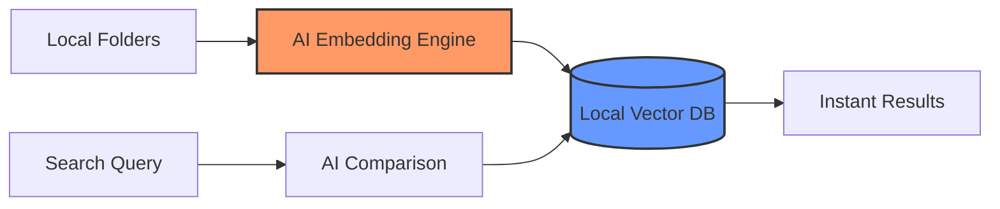

# 🖼️ FindMyPic — Local AI-Powered Search

> **Find any photo or document on your PC by describing it.**  
> *100% Local. 100% Private. No Cloud. Zero Data Leaks.*

---

---

## ✨ The Problem
You have thousands of photos and documents scattered across drives. Search only works if you remember the exact file name. Most AI search tools (Google Photos, iCloud) require you to upload your private life to their servers. 

## 🚀 The Solution
**FindMyPic** brings a powerful, multi-modal AI brain directly to your desktop. It indexes your local files and allows for **Semantic Search**—meaning you search for the *meaning* of an image or document, not just its name.

- 🔍 **Search for anything:** *"screenshot of my crypto wallet recovery phrase"*, *"photo of my dog at the beach"*, or *"gym membership invoice from 2022"*.
- 🛡️ **Total Privacy:** Everything stays on your hard drive. No trackers, no telemetry, no cloud.
- ⚡ **GPU Accelerated:** Automatically detects your hardware and uses the best AI models for your specific PC.

---

## 🛠️ How It Works

1. **Scan:** The app scans your chosen drives/folders.
2. **Index:** AI models (CLIP, LLaVA, Tesseract) "watch" and "read" your files.
3. **Embed:** Content is converted into high-dimensional vectors stored in a local **ChromaDB**.
4. **Find:** Your natural language query is matched against the database in milliseconds.

---

## 💻 Hardware Tiers (Auto-Detection)

FindMyPic is optimized for everything from low-end laptops to enthusiast gaming rigs:

| Tier | Hardware | Performance | Model Used |
| :--- | :--- | :--- | :--- |
| **Tier 1** | No GPU / Integrated | Reliable | CLIP (INT8) + Moondream |
| **Tier 2** | Entry GPU (4-6GB) | Fast | CLIP (FP16) + Moondream |
| **Tier 3** | Mid-Range (8-12GB) | Very Fast | CLIP L/14 + LLaVA 7B |
| **Tier 4** | High-End (16GB+) | Instant | CLIP L/14 + LLaVA 13B |

---

## 📦 Features

- ✅ **Image Search:** Find photos by objects, scenes, or "vibe".
- ✅ **Document OCR:** Search inside scanned PDFs and image screenshots.
- ✅ **Incremental Indexing:** Only scans new or changed files to save time.
- ✅ **Background Service:** Sits in your system tray and keeps your index up-to-date.
- ✅ **Smart Filters:** Sort by date, file type, size, or folder.

---

## 🛠️ Tech Stack

- **Frontend:** React + TypeScript + Electron
- **Backend:** Python (FastAPI)
- **AI Engine:** ONNX Runtime & Ollama
- **Database:** ChromaDB (Vector Store)
- **Libraries:** OpenAI CLIP, LLaVA, PyTesseract

---

## 🚥 Getting Started

### Prerequisites
- Windows 10/11
- 8GB RAM minimum
- (Recommended) [Ollama](https://ollama.com) installed for advanced captioning

### Installation
1. Download the latest installer from the [Releases](https://github.com/) page.
2. Open the app and select the folders you want to index.
3. Wait for the initialization to complete (the app will recommend a model tier based on your GPU).
4. Start searching!

---

## 📝 License
Distributed under the MIT License. See `LICENSE` for more information.

---

*Built with ❤️ for privacy enthusiasts.*
